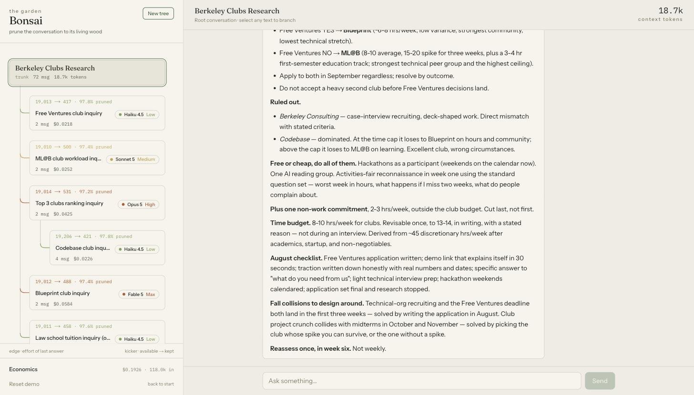

# 🌱 Bonsai

[](https://github.com/TarunYadgirkar/Bonsai/actions/workflows/ci.yml)
[](https://www.npmjs.com/package/bonsai-engine)
[](LICENSE)

**Prune the conversation to its living wood.** Bonsai turns AI chat from a growing scroll into a
tree: branch a side question with a *compiled minimal brief* instead of the full history,
auto-route each branch to the right model and effort, and merge exactly one distilled insight back
into the trunk. It runs on the Claude subscription you already pay for — no API key.

> The cheapest token is the one you don't send.

**Try it in 60 seconds:** open the **[live demo](https://bonsai-connector.vercel.app)** (no keys, no
account — briefs, routing, and pruning are real; answers are an honest mock), or attach Bonsai to
your own claude.ai at **[/connect](https://bonsai-connector.vercel.app/connect)** — one click mints
your private connector link, then say *"fork this side question with Bonsai"* in any chat and
*"show my bonsai tree"* to see your garden render inline.



**[Live demo](https://bonsai-connector.vercel.app)** · **[Interactive garden](https://claude.ai/code/artifact/b1b44d60-59a7-4237-8b56-26ae5c1b06ce)** · [The design system](DESIGN.md) · [The moat](MOAT.md)

---

## Why it's different

Every branching chat that shipped — ChatGPT (Sept 2025), Gemini (May 2026), LibreChat, Msty,
TypingMind — forks by **copying the whole history**. That's Save-As: the copy drags every token
along, the side question runs on the priciest possible context, and nothing the branch learns ever
comes back. Bonsai is the loop those products don't have:

1. **Fork with a compiled brief.** A branch inherits ≤8 referent-resolved facts plus an explicit
   note of what was excluded — a 19,000-token trunk becomes a ~400-token brief. Briefs compose
   recursively, so a branch of a branch inherits resolution work already done above it.
2. **Route the branch.** A cheap classifier reads the brief and the question, picks model + effort,
   flags when the brief doesn't cover the question, and — the interesting part — **learns**:
   overrides, escalations, and merges become per-question-kind priors, so *your* rewrites route
   cheap while *your* "analyze" routes deep. New users cold-start from an aggregated community prior.
3. **Escalate context-first.** A punt widens the brief with parent turns before it ever upgrades
   the model. Manual picks are never silently overridden.
4. **Merge one insight back.** A branch returns a single distilled sentence to its parent — which
   then genuinely enters the parent's context and every future sibling's brief.

## The technically interesting bits

- **Path-based context assembly** (`packages/engine/src/context.ts`) — referents resolved at depth
  N stay resolved at depth N+1 because the resolution travels inside composed briefs. Proven at
  depth 2 in the eval harness, not just asserted.
- **A learning router with a network effect** (`learning.ts`) — per-user, per-question-kind priors,
  confidence-gated, with a `mergeProfiles()` community cold-start. This is the [moat](MOAT.md): the
  routing memory compounds per-user *and* across users.
- **Honest economics** (`stats.ts`) — tokenizer-generation correction (the 4.7+/5 tokenizer runs
  ~1.3× heavier), measured-vs-modeled provenance on every figure, per-purpose and per-model spend.
- **A referent-resolution benchmark** ([`evals/`](BENCHMARK.md)) — `npm run eval` *executes* the
  correctness claim that makes compiled briefs safe (referent resolution at depth 2, salience over
  keyword noise). Differential and provider-agnostic. Runs in CI.

## Three surfaces, one engine, zero API keys

| Surface | What it is |
|---|---|
| **MCP connector** (`app/api/mcp/`) | A claude.ai custom connector — self-serve at [/connect](https://bonsai-connector.vercel.app/connect). Claude compiles the brief in-conversation; the connector holds the tree and renders it inline as an interactive MCP Apps garden. |
| **Claude Code plugin** (`plugin/`) | Branch = subagent with a compiled brief; merge = distilled report. Runs on your Claude Code subscription. |
| **Web app** (`app/`, `components/`) | The hosted demo + engine testbed: streaming chat, ⌘K palette, export, per-branch economics. Mock-first: runs with zero keys. |

(A Chrome extension surface lives in `extension/` with full e2e coverage but is deliberately
parked: a claude.ai extension can never run the loop unattended, and its remaining prefill role
is covered better by the connector.)

Install the plugin:

```
/plugin marketplace add TarunYadgirkar/Bonsai
/plugin install bonsai@bonsai
```

(The plugin currently lives on branch `copy-a`, not `main` — reference this branch until promotion, and the repo must be public.)

The durable value is `bonsai-engine` — a dependency-free TypeScript package the four surfaces all
consume, and publishable on its own (`cd packages/engine && pnpm publish` builds a typed `dist` via
`prepublishOnly`). Tree model, path assembly, salience compiler, learning router, honest pricing.
212 unit tests; the referent-resolution benchmark runs in CI.

## Run it

```bash
npm install
npm run dev        # zero keys: extractive mock inference, in-memory store
npm run test       # engine + extension unit tests
npm run eval       # the referent-resolution benchmark (mock mode; live-graded with a key)
```

Set `DATABASE_URL` (Neon) for durable storage — schema in `migrations/`. Set one of
`ANTHROPIC_API_KEY` / `OPENAI_API_KEY` / `XAI_API_KEY` for live inference; every dependency degrades
to a working local path when its key is absent.

## Repo map

| Path | What |
|---|---|
| `packages/engine/` | `bonsai-engine` — the core. Zero runtime deps. |
| `app/` · `components/` | Next.js demo + API routes over the engine. |
| `plugin/` · `extension/` | The Claude Code plugin and the Chrome extension. |
| `evals/` | The referent-resolution + routing benchmark. |
| `PRODUCT.md` · `MOAT.md` · `DESIGN.md` | The idea, the defensibility, the design system. |
| `AGENTS.md` · `CONTRIBUTING.md` | Rules for agents; how to contribute. |

MIT licensed. Built by [Tarun Yadgirkar](https://tarunyadgirkar.com).
